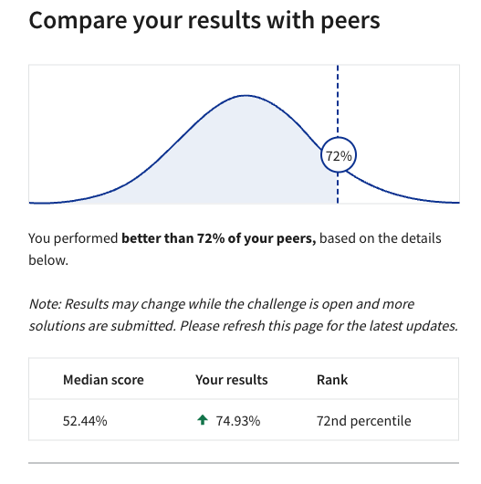

## **Loan Default Prediction**
### Data Science Coding Challenge

### **Context:**

This project, part of the Coursera Data Science Coding Challenge, aims to predict loan defaults based on various borrower-specific features. Understanding the patterns and correlations in the data allows lenders to better predict and mitigate potential loan defaults, ensuring a healthier portfolio and risk management.

### **Achievement:**

This solution achieved a position in the top 28% of submissions for the challenge.



### **Folder Structure:**

```markdown
markdownCopy code
loan_default_prediction/
│
├── data/
│   ├── train.csv
│   └── test.csv
│
├── exploratory_analysis/
│   ├── __init__.py
│   ├── data_cleaning.py
│   ├── data_visualization.py
│   └── data_preprocessing.py
│
├── models/
│   ├── __init__.py
│   ├── feature_selection.py
│   ├── train_model.py
│   └── predict_model.py
│
└── main.py
└── exploratory_analysis.ipynb
└── requirements.txt
└── README.md
```

### **Workflow:**

1. **Exploratory Data Analysis (EDA)**: Start by examining the provided **`exploratory_analysis.ipynb`** notebook to gain insights from the data and understand the relationship among various features. This step is fundamental for subsequent feature engineering and selection.
2. **Data Preprocessing**: Based on insights from the EDA, specific features are selected for the modeling phase. The preprocessing steps include:
    - Removing duplicates
    - Handling missing values
    - Data transformation (such as normalization or encoding)
    - Feature scaling
    - One-hot encoding for categorical variables
    - Applying SMOTE for oversampling the minority class (to deal with class imbalance)
3. **Model Training & Prediction**:
    - Data is split into training and validation sets.
    - Multiple models are trained using a defined search space, including parameters for logistic regression, random forests, XGBoost, CatBoost, KNN, and Gaussian Naive Bayes.
    - The best model is used to make predictions on the test set.
    - Predictions are saved in **`data/prediction_submission.csv`**.

### **Execution:**

1. Begin by examining the **`exploratory_analysis.ipynb`** notebook for EDA.
2. Execute **`main.py`** for preprocessing, training, and prediction.

### **Dependencies:**

- **`imblearn`** for handling imbalanced datasets.
- Model-specific libraries for different algorithms listed in the search space.